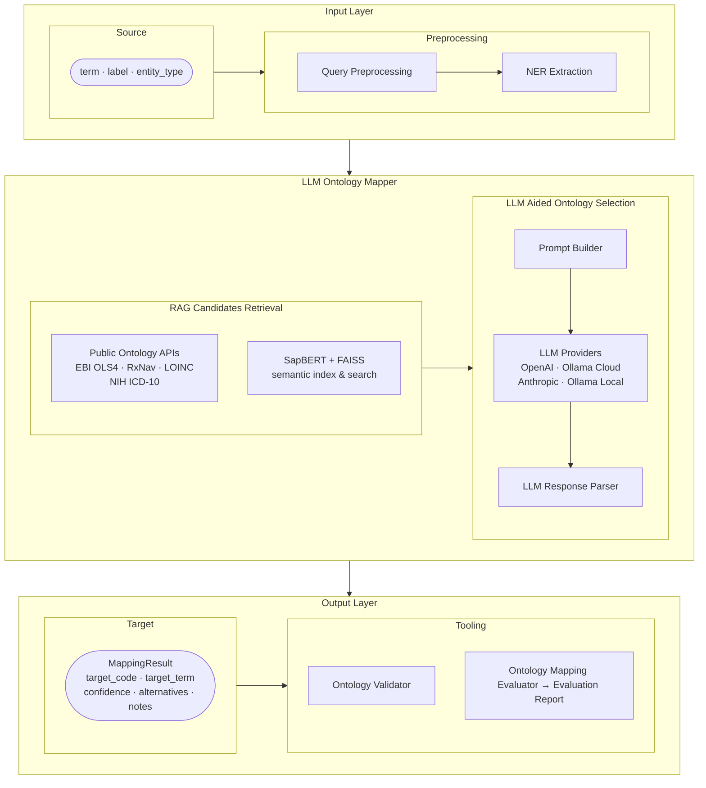

# LLM Ontology Mapper

LLM-powered Python library that resolves clinical and biomedical terms to standard ontology codes (HPO, MONDO, NCIT, LOINC, …). It combines RAG-grounded candidate retrieval, NER-enhanced query extraction, and built-in accuracy evaluation.




---

## Getting started

### Prerequisites

- Python ≥ 3.10
- [`uv`](https://docs.astral.sh/uv/) package manager
- *(Optional)* A running **SapBERT+FAISS server** for semantic RAG retrieval. When available, the retriever sends embedding queries to this server instead of falling back to the Ontology APIs. Point to it via:

  ```bash
  export SAPBERT_SERVER_URL="http://your-sapbert-server:8000"
  ```

  The server must expose a `POST /search` endpoint that accepts `{"query": str, "ontology": str, "top_k": int}` and returns `{"results": [{"code", "term", "score", "definition"}]}`. If `SAPBERT_SERVER_URL` is not set, the retriever silently falls back to Ontology API lookups.

- An account with at least one supported LLM provider, and the corresponding credentials set as environment variables:

| Provider | Extra | Environment variable(s) |
|---|---|---|
| Ollama cloud | `ollama` | `OLLAMA_BASE_URL`, `OLLAMA_API_KEY` |
| Ollama local server | `ollama` | `OLLAMA_BASE_URL` (default `http://localhost:11434`) |
| OpenAI | `openai` | `OPENAI_API_KEY` |
| GitHub Models | `openai` | `GITHUB_TOKEN` |
| Anthropic | `anthropic` | `ANTHROPIC_API_KEY` |

Live LOINC search uses the official LOINC Search API rather than FHIR
ValueSet expansion and requires one configured service credential:

```bash
export LOINC_USERNAME="..."
export LOINC_PASSWORD="..."
```

Bridge and backend deployments can configure these variables once in the
service runtime. End users of those deployments do not need individual LOINC
accounts. Credentials are used only for authenticated LOINC API requests.

### Installation

> **Note:** This package is not yet published to PyPI. Install directly from the repository.

```bash
git clone https://github.com/courtotlab/llm-ontology-mapper
cd llm-ontology-mapper
uv pip install '.[ollama]'    # Ollama (cloud or local)
uv pip install '.[openai]'    # OpenAI / GitHub Models
uv pip install '.[eval]'      # + pandas for evaluation
uv pip install '.[all]'       # everything
```

Then export your provider credentials, for example for Ollama cloud:

```bash
export OLLAMA_BASE_URL="https://ollama.com"   # or your remote host URL
export OLLAMA_API_KEY="your-api-key"
```

### Usage

```python
from llm_ontology_mapper import OntologyMapper

# Ollama cloud
mapper = OntologyMapper(
    provider="ollama",
    model="gpt-oss:120b",
    base_url=os.environ.get("OLLAMA_BASE_URL", "https://ollama.com"),
    api_key=os.environ.get("OLLAMA_API_KEY", "your-api-key"),
)

result = mapper.map_term(
    source_term="cough",
    source_label="Does the patient have a cough?",
    entity_type="phenotype",
)

print(result.target_code)   # HP:0012735
print(result.target_term)   # Cough
print(result.confidence)    # 0.99
print(result.notes)         # LLM reasoning
```

For batch mapping, RAG-enhanced mapping, evaluation, and code validation, try the interactive notebook:

```bash
jupyter lab jupyter_notebook/playground.ipynb
```

The notebook covers all features with working examples — just select your `.venv` as the kernel.

---

## Repository structure

```
llm-ontology-mapper/
├── src/llm_ontology_mapper/
│   ├── __init__.py          ← Public API — import only from here
│   ├── models.py            ← Pydantic schemas: MappingResult, MappingBatch, …
│   ├── providers.py         ← LLM backends (OpenAI / Anthropic / Ollama) + factory
│   ├── mapper.py            ← OntologyMapper — orchestrates provider + retriever + prompts
│   ├── retriever.py         ← OntologyRetriever — RAG candidate retrieval via public APIs
│   ├── validator.py         ← OntologyValidator — standalone ontology code existence checker
│   ├── evaluator.py         ← OntologyMappingEvaluator — benchmark accuracy measurement
│   ├── ner_extractor.py     ← NERQueryExtractor — biomedical entity extraction (scispaCy)
│   └── assets/
│       ├── ontology_config.yaml   ← Ontology scope definitions (HPO, MONDO, NCIT, …)
│       └── prompts/
│           ├── mapping_prompt.txt ← Prompt used when RAG is disabled
│           └── rag_prompt.txt     ← Prompt used when RAG candidates are available
├── jupyter_notebook/
│   └── playground.ipynb     ← Interactive walkthrough of all features
├── tests/                   ← pytest unit and integration tests
└── pyproject.toml           ← Project metadata, dependencies, tool config
```
---

## `MappingResult` fields

| Field | Type | Description |
|---|---|---|
| `source_term` | `str` | Original field name |
| `target_code` | `str` | Ontology CURIE, e.g. `HP:0012735`. Bare codes (e.g. LOINC `8480-6`) are auto-normalised to `PREFIX:code` on construction |
| `target_term` | `str` | Official label |
| `ontology` | `str` | Namespace: `HPO`, `MONDO`, `NCIT`, … |
| `confidence` | `float` | `[0.0, 1.0]` |
| `logic_type` | `LogicType` | How the code was determined — see below |
| `alternatives` | `list` | Runner-up mappings |

### `logic_type` values

| Value | Meaning |
|---|---|
| `llm` | LLM generated the code directly from its training knowledge — no retrieval was performed |
| `rag` | A single retrieval source (e.g. OLS4 API) produced a candidate shortlist; LLM selected and validated one from the list |
| `direct` | A RAG candidate scored above the auto-accept threshold and was returned without an LLM call |
| `hybrid` | Multiple retrieval sources (e.g. OLS4 API **and** SapBERT+FAISS) were used in parallel; LLM re-ranked and reconciled potentially conflicting candidates across sources |

---

## Contributing

### Build process

```bash
git clone https://github.com/courtotlab/llm-ontology-mapper
cd llm-ontology-mapper

uv sync --extra dev --extra openai --extra eval   # create venv + install deps
uv build                                          # build wheel
```

### Code quality

```bash
uv run pytest -m unit                             # fast unit tests (no API keys needed)
uv run pytest --cov=llm_ontology_mapper           # with coverage
uv run ruff check src/                            # lint
uv run ruff format src/                           # format
uv run mypy src/                                  # type check
```

### Pull requests
If you are an outside contributor, you'll want to fork the repo first. Members of the Courtot Lab can create a branch on this repo instead.
1. Create a feature branch from `main`. (`git checkout -b feature/fooBar`)
2. Ensure all tests pass and coverage does not regress: `uv run pytest --cov=llm_ontology_mapper`.
3. Run lint and type checks (`ruff`, `mypy`) with no new errors before opening a PR.
4. Add or update tests for any changed behaviour.
5. Keep pull requests focused — one feature or fix per PR.

---

## Authors

- [**Linda Xiang**](https://github.com/lindaxiang)

---

## Citation

If you use this library in your research, please cite the repository:

```
https://github.com/courtotlab/llm-ontology-mapper
```
