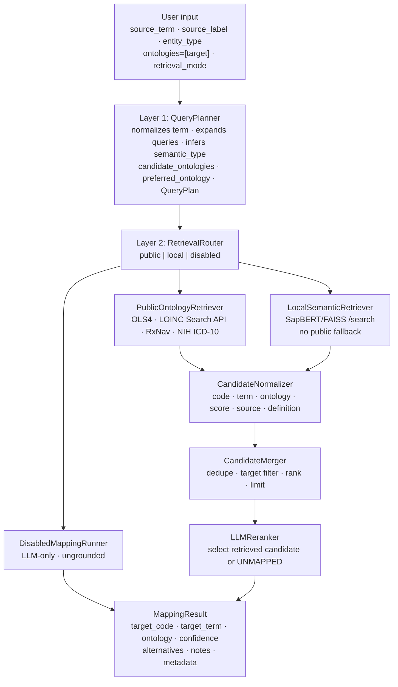

# LLM Ontology Mapper

LLM-powered Python library that resolves clinical and biomedical terms to standard ontology codes such as HPO, MONDO, NCIT, LOINC, RxNorm, and ICD-10. The package now includes an opt-in planned, grounded pipeline that plans retrieval, searches configured ontology sources, normalizes candidates, and asks an LLM to choose only from grounded candidates or return `UNKNOWN:UNMAPPED`.

The older `OntologyMapper` flow, legacy RAG retriever, NER extractor, evaluator, validator, and agentic mapper are still present. The planned pipeline is enabled explicitly with `use_planned_pipeline=True`.

## Architecture



The planned pipeline builds a `QueryPlan` with the normalized term, expanded retrieval queries, inferred meaning, semantic type, candidate ontologies, preferred ontology, retrieval mode, target constraint, disabled reason, reasoning, and planner confidence.

---

## Getting started

### Prerequisites

- Python >= 3.10
- [`uv`](https://docs.astral.sh/uv/) package manager
- An account with at least one supported LLM provider, and the corresponding credentials set as environment variables:

| Provider | Extra | Environment variable(s) |
|---|---|---|
| Ollama cloud | `ollama` | `OLLAMA_BASE_URL`, `OLLAMA_API_KEY` |
| Ollama local server | `ollama` | `OLLAMA_BASE_URL` (default `http://localhost:11434`) |
| OpenAI | `openai` | `OPENAI_API_KEY` |
| GitHub Models | `openai` | `GITHUB_TOKEN` |
| Anthropic | `anthropic` | `ANTHROPIC_API_KEY` |

Planned public mode uses public ontology APIs:

- EBI OLS4 for supported OLS ontologies such as HPO/HP, MONDO, NCIT, SNOMED, UBERON, CHEBI, GO, DOID, MESH, and UO
- LOINC Search API for LOINC
- RxNav for RxNorm/RxNav
- NIH Clinical Tables for ICD-10-CM

Live LOINC search uses the official LOINC Search API and requires configured service credentials:

```bash
export LOINC_USERNAME="..."
export LOINC_PASSWORD="..."
```

Planned local mode requires a configured SapBERT/FAISS-compatible service exposing:

```text
POST /search
Body:  {"query": str, "ontology": str | null, "top_k": int}
Reply: {"results": [{"code": str, "term": str, "score": float, "definition": str}]}
```

Planned local mode does not silently fall back to public ontology APIs. If the local service is unavailable or not configured, local retrieval fails instead of switching to public mode.

### Installation

> **Note:** This package is not yet published to PyPI. Install directly from the repository.

```bash
git clone https://github.com/courtotlab/llm-ontology-mapper
cd llm-ontology-mapper
uv pip install '.[ollama]'     # Ollama cloud or local
uv pip install '.[openai]'     # OpenAI / GitHub Models
uv pip install '.[anthropic]'  # Anthropic
uv pip install '.[eval]'       # pandas + plotting for evaluation
uv pip install '.[all]'        # everything
```

Then export your provider credentials, for example:

```bash
export OPENAI_API_KEY="..."
```

### Planned pipeline usage

```python
from llm_ontology_mapper import OntologyMapper

mapper = OntologyMapper(
    provider="openai",
    model="gpt-4.1-mini",
    use_planned_pipeline=True,
    retrieval_mode="public",
    ontologies=["LOINC"],
)

result = mapper.map_term(
    source_term="sys_bp",
    source_label="systolic blood pressure",
    entity_type="measurement",
)

print(result.target_code)
print(result.target_term)
print(result.ontology)
print(result.confidence)
print(result.notes)
```

`ontologies=["LOINC"]` is the current public-wrapper pattern for a single target ontology in planned mode. Do not pass `target_ontology=` to `OntologyMapper.map_term()`; the public `map_term()` wrapper does not expose that argument.

For local SapBERT/FAISS retrieval, inject a configured local retriever into the planned pipeline:

```python
from llm_ontology_mapper import (
    LocalSemanticRetriever,
    OntologyMapper,
    OpenAIProvider,
    PlannedPipeline,
)

provider = OpenAIProvider(model="gpt-4.1-mini")
pipeline = PlannedPipeline(
    provider=provider,
    local_retriever=LocalSemanticRetriever(sapbert_url="http://localhost:8765"),
)

mapper = OntologyMapper(
    llm_provider=provider,
    use_planned_pipeline=True,
    retrieval_mode="local",
    ontologies=["LOINC"],
    planned_pipeline=pipeline,
)
```

### Inputs and options

| Input / option | Where it is passed | Meaning |
|---|---|---|
| `source_term` | `map_term()` | Required source field name or compact term, e.g. `sys_bp` |
| `source_label` | `map_term()` | Optional human-readable label or question text |
| `source_type` | `map_term()` | Optional source schema/type hint such as `integer`, `radio`, or `text` |
| `entity_type` | `map_term()` | Optional clinical/domain hint; planned mode passes this through as `clinical_area` |
| `ontologies` | `OntologyMapper(...)` | Optional ontology scope; in planned mode, at most one explicit ontology is currently supported as the target constraint |
| `retrieval_mode` | `OntologyMapper(...)` or planned `map_term()` override | One of `public`, `local`, or `disabled`; only supported when planned mode is enabled |
| `use_planned_pipeline` | `OntologyMapper(...)` or `map_term()` override | Enables the planned pipeline instead of the legacy mapper flow |

### Retrieval modes

| Mode | Behavior |
|---|---|
| `public` | Searches public ontology APIs through `PublicOntologyRetriever`, normalizes and merges candidates, then uses grounded LLM reranking. |
| `local` | Searches a configured SapBERT/FAISS-compatible `/search` service through `LocalSemanticRetriever`, with no public API fallback. |
| `disabled` | Skips retrieval and candidate reranking; calls the LLM-only disabled path and marks the result as ungrounded. |

There is no confirmed public+local hybrid or `both` retrieval mode in the planned pipeline.

### Legacy mapper flow

Without `use_planned_pipeline=True`, `OntologyMapper.map_term()` uses the legacy prompt/response flow. Legacy RAG can still be enabled with `use_rag=True` and an `ontology_retriever`, and the older `OntologyRetriever`, `NERQueryExtractor`, validator, evaluator, and `AgenticMapper` remain available.

For batch mapping, legacy RAG-enhanced mapping, evaluation, and code validation, try the interactive notebook:

```bash
jupyter lab jupyter_notebook/playground.ipynb
```

---

## Repository structure

```text
llm-ontology-mapper/
├── src/llm_ontology_mapper/
│   ├── __init__.py                 # Public API exports
│   ├── models.py                   # Pydantic schemas: MappingResult, QueryPlan, candidates, traces
│   ├── providers.py                # LLM backends (OpenAI / Anthropic / Ollama) + factory
│   ├── mapper.py                   # OntologyMapper public wrapper; legacy and planned entry point
│   ├── planned_pipeline.py         # PlannedPipeline orchestrator
│   ├── query_planner.py            # Layer 1 LLM query planning
│   ├── retrieval_router.py         # Layer 2 retrieval route planning
│   ├── public_retriever.py         # Public API retrieval wrapper
│   ├── local_retriever.py          # Local SapBERT/FAISS retrieval wrapper
│   ├── candidate_normalizer.py     # Raw candidate -> NormalizedCandidate
│   ├── candidate_merger.py         # Deduplication, target filtering, ranking
│   ├── llm_reranker.py             # Grounded reranking over retrieved candidates
│   ├── mapping_result_builder.py   # Grounded decision -> MappingResult
│   ├── disabled_mapping.py         # Disabled retrieval / LLM-only result path
│   ├── retriever.py                # Legacy RAG retriever
│   ├── validator.py                # Standalone ontology code existence checker
│   ├── evaluator.py                # Benchmark accuracy measurement
│   ├── ner_extractor.py            # Optional scispaCy NER extractor for legacy workflows
│   └── assets/
│       ├── ontology_config.yaml
│       └── prompts/
│           ├── query_planner_prompt.txt
│           ├── llm_reranker_prompt.txt
│           ├── disabled_mapping_prompt.txt
│           ├── mapping_prompt.txt
│           └── rag_prompt.txt
├── jupyter_notebook/
│   └── playground.ipynb
├── tests/
│   └── live/README.md              # Manual live smoke script instructions
└── pyproject.toml
```

---

## `MappingResult` fields

| Field | Type | Description |
|---|---|---|
| `source_term` | `str` | Original source field name or term |
| `source_label` | `str` or `None` | Optional human-readable label or question text |
| `source_type` | `str` or `None` | Optional source schema/type hint |
| `target_code` | `str` | Ontology CURIE, e.g. `HP:0012735` or `LOINC:8480-6`; unmapped planned results use `UNKNOWN:UNMAPPED` |
| `target_term` | `str` | Official mapped label, or `UNMAPPED` |
| `ontology` | `str` | Namespace such as `HPO`, `MONDO`, `NCIT`, `LOINC`, `RXNORM`, `ICD10`, or `UNKNOWN` |
| `confidence` | `float` | Confidence score in `[0.0, 1.0]` |
| `logic_type` | `LogicType` | Strategy that produced the mapping |
| `alternatives` | `list[AlternativeMapping]` | Grounded runner-up mappings when available |
| `notes` | `str` or `None` | LLM reasoning, caveats, or unmapped explanation |
| `metadata` | `MappingMetadata` or `None` | Provider/runtime metadata; planned mode stores pipeline trace details in `metadata.rag_debug` |

### `logic_type` values

| Value | Meaning |
|---|---|
| `llm` | LLM-only mapping. In planned mode this is used by `retrieval_mode="disabled"` and is explicitly ungrounded. |
| `rag` | Retrieved candidates were used. In planned public/local mode, the LLM reranker selects from grounded candidates or returns `UNKNOWN:UNMAPPED`. |
| `direct` | Legacy or reserved enum value; not the normal planned pipeline path. |
| `hybrid` | Legacy or reserved enum value; the planned pipeline does not currently expose a public+local hybrid mode. |
| `agentic` | Tool-calling `AgenticMapper` path, separate from the planned pipeline. |

---

## Live smoke scripts

Manual live smoke scripts are documented in `tests/live/README.md`. Planned pipeline smoke scripts are:

```bash
uv run python tests/live/planned_public_smoke.py
uv run python tests/live/planned_local_smoke.py
uv run python tests/live/planned_disabled_smoke.py
```

These scripts are direct runnable experiments, not pytest tests. They may contact live APIs, a local Ollama server, or a configured local SapBERT service depending on the selected constants and environment variables.

---

## Contributing

### Build process

```bash
git clone https://github.com/courtotlab/llm-ontology-mapper
cd llm-ontology-mapper

uv sync --extra dev --extra openai --extra eval   # create venv + install deps
uv build                                          # build wheel
```

### Code quality

```bash
uv run pytest -m unit                             # fast unit tests (no API keys needed)
uv run pytest --cov=llm_ontology_mapper           # with coverage
uv run ruff check src/                            # lint
uv run ruff format src/                           # format
uv run mypy src/                                  # type check
```

### Pull requests

If you are an outside contributor, you'll want to fork the repo first. Members of the Courtot Lab can create a branch on this repo instead.

1. Create a feature branch from `main`. (`git checkout -b feature/fooBar`)
2. Ensure all tests pass and coverage does not regress: `uv run pytest --cov=llm_ontology_mapper`.
3. Run lint and type checks (`ruff`, `mypy`) with no new errors before opening a PR.
4. Add or update tests for any changed behaviour.
5. Keep pull requests focused: one feature or fix per PR.

---

## Authors

- [**Linda Xiang**](https://github.com/lindaxiang)

---

## Citation

If you use this library in your research, please cite the repository:

```text
https://github.com/courtotlab/llm-ontology-mapper
```
