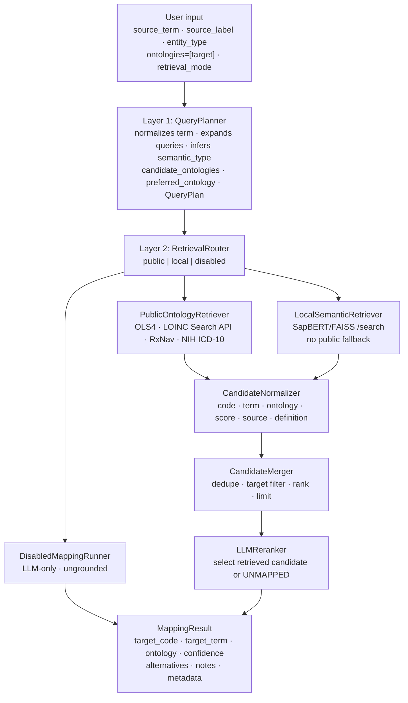

# LLM Ontology Mapper

LLM-powered Python library for mapping clinical and biomedical source fields to ontology identifiers. It accepts compact source terms, optional labels/descriptions, source data types, and entity/domain hints, then returns a structured `MappingResult` with the selected code, term, ontology, confidence, alternatives, notes, and runtime metadata.

The current grounded path is the opt-in planned pipeline. It uses an LLM to plan ontology search, retrieves candidates from public ontology APIs or a configured local SapBERT/FAISS service, normalizes and merges candidates, and asks an LLM reranker to select only from retrieved candidates or return `UNKNOWN:UNMAPPED`. Retrieval can also be disabled for explicitly ungrounded LLM-only mapping.

The legacy `OntologyMapper` prompt flow, legacy RAG retriever, NER extractor, evaluator, validator, and tool-calling `AgenticMapper` remain available. The planned pipeline is enabled explicitly with `use_planned_pipeline=True`.

## Architecture



The diagram above is a high-level view. The implementation currently runs these stages:

1. `QueryPlanner` receives `source_term`, optional `source_label`, keyword-only `source_description`, `source_type`, `entity_type` as `clinical_area`, target ontology constraints, and `retrieval_mode`. It calls the configured provider and builds a `QueryPlan` with normalized wording, expanded retrieval queries, inferred meaning, semantic type, candidate ontologies, preferred ontology, hard allow-list information, reasoning, and planner confidence. Python code then re-applies caller constraints so the LLM cannot change the requested retrieval mode or target ontology.
2. `RetrievalRouter` converts the `QueryPlan` into a `RetrievalRoutePlan`. It deduplicates queries, decides the grounding source (`public_api`, `local_sapbert`, or `none`), and records route descriptors. It does not call external services.
3. `PublicOntologyRetriever` or `LocalSemanticRetriever` executes retrieval for public/local modes. Each expanded query is searched against the routed ontology or ontologies. Raw candidates are enriched with the matched query, retrieval mode, requested ontology, and route name.
4. `CandidateNormalizer` converts raw retriever dictionaries to `NormalizedCandidate` records. It resolves code/IRI/ontology identity, normalizes CURIEs where possible, preserves definitions/scores/provenance, and rejects malformed or inconsistent candidates.
5. `CandidateMerger` deduplicates candidates, applies target ontology constraints or allow-lists as hard filters, sorts by retrieval score, and applies `max_candidates`.
6. `LLMReranker` receives only the merged candidates. It must pick a provided candidate ID/code pair, return grounded alternatives from the same candidate list, or return unmapped. If no eligible candidates remain, it returns unmapped without another provider call.
7. `MappingResultBuilder` converts the reranker decision to `MappingResult`, attaches alternatives, and stores pipeline/debug metadata in `metadata.rag_debug`.

For `retrieval_mode="disabled"`, the pipeline still performs query planning and routing, then calls `DisabledMappingRunner`. It skips retrieval, normalization, merging, reranking, and grounded result building; the result is marked ungrounded with `logic_type="llm"`.

---

## Getting started

### Prerequisites

- Python >= 3.10
- [`uv`](https://docs.astral.sh/uv/) package manager
- At least one configured LLM provider.

| Provider selector | Extra | Configuration |
|---|---|---|
| `openai` | `openai` | Pass `api_key=` or set `OPENAI_API_KEY` for the OpenAI SDK. |
| `github` | `openai` | Uses `https://models.inference.ai.azure.com`; pass a GitHub Models token via `api_key=`. |
| `azure` | `openai` | Pass `api_key=` plus `azure_endpoint=` and, if needed, `azure_api_version=`. |
| `anthropic` | `anthropic` | Pass `api_key=` or set `ANTHROPIC_API_KEY` for the Anthropic SDK. |
| `ollama` or `local` | `ollama` | Local Ollama uses the SDK default host. Pass `base_url=` for a remote/proxied server and `api_key=` for an optional bearer token. |

Planned public mode uses the repository's `SearchTools` public API adapters:

- EBI OLS4 for supported OLS ontologies such as HPO/HP, MONDO, NCIT, SNOMED, UBERON, CHEBI, GO, DOID, MESH, UO, and EFO
- LOINC Search API for LOINC
- RxNav for RxNorm/RxNav
- NIH Clinical Tables for ICD-10-CM

Live LOINC search uses the official LOINC Search API and requires configured service credentials:

```bash
export LOINC_USERNAME="..."
export LOINC_PASSWORD="..."
```

Planned local mode requires an injected `LocalSemanticRetriever` configured with a SapBERT/FAISS-compatible service exposing:

```text
POST /search
Body:  {"query": str, "ontology": str | null, "top_k": int}
Reply: {"results": [{"code": str, "term": str, "score": float, "definition": str}]}
```

Planned local mode does not silently fall back to public ontology APIs. If the local service is unavailable or not configured, local retrieval fails instead of switching to public mode.

### Installation

> **Note:** This package is not yet published to PyPI. Install directly from the repository.

```bash
git clone https://github.com/courtotlab/llm-ontology-mapper
cd llm-ontology-mapper
uv sync --extra openai          # OpenAI, GitHub Models, or Azure OpenAI
uv sync --extra ollama          # Ollama
uv sync --extra anthropic       # Anthropic
uv sync --extra eval            # pandas + plotting for evaluation
uv sync --extra all             # all optional runtime extras
```

Then export your provider credentials, for example:

```bash
export OPENAI_API_KEY="..."
```

For editable installation into an existing environment, run the equivalent `uv pip install -e '.[openai]'`, `uv pip install -e '.[ollama]'`, or `uv pip install -e '.[anthropic]'` from the repository root.

### Usage examples

#### Example 1: basic single-term mapping

By default, `OntologyMapper.map_term()` uses the legacy LLM prompt flow.

```python
from llm_ontology_mapper import OntologyMapper

mapper = OntologyMapper(
    provider="openai",
    model="gpt-4.1-mini",
)

result = mapper.map_term(
    source_term="cough",
    source_label="Do you have a cough?",
    entity_type="phenotype",
)

print(result.target_code, result.target_term, result.logic_type)
```

#### Example 2: grounded mapping with a target ontology

In planned mode, a single `ontologies=[...]` value becomes a hard target ontology constraint.

```python
from llm_ontology_mapper import OntologyMapper

mapper = OntologyMapper(
    provider="openai",
    model="gpt-4.1-mini",
    use_planned_pipeline=True,
    retrieval_mode="public",
    ontologies=["LOINC"],
)

result = mapper.map_term(
    source_term="sys_bp",
    source_label="systolic blood pressure",
    entity_type="measurement",
)

print(result.target_code)
print(result.target_term)
print(result.ontology)
print(result.confidence)
print(result.notes)
```

Do not pass `target_ontology=` to `OntologyMapper.map_term()`; the public wrapper does not expose that argument. Use mapper-level `ontologies=[...]` for target constraints or instantiate `PlannedPipeline` directly for the lower-level planned API.

#### Example 3: mapping with source description

`source_description` is keyword-only and is used by the query planner as extra context.

```python
from llm_ontology_mapper import OntologyMapper

mapper = OntologyMapper(
    provider="openai",
    model="gpt-4.1-mini",
    use_planned_pipeline=True,
    retrieval_mode="public",
    ontologies=["LOINC"],
)

result = mapper.map_term(
    source_term="creat",
    source_label="Serum creatinine",
    source_type="decimal",
    entity_type="measurement",
    source_description="Most recent serum creatinine result collected at enrolment",
)
```

#### Example 4: multiple target ontologies

Multiple `ontologies` values are supported in planned mode as a hard allow-list. The planner and retrievers search within that list, and the merger/reranker reject candidates outside it.

```python
from llm_ontology_mapper import OntologyMapper

mapper = OntologyMapper(
    provider="openai",
    model="gpt-4.1-mini",
    use_planned_pipeline=True,
    retrieval_mode="public",
    ontologies=["LOINC", "HPO", "MONDO"],
)

result = mapper.map_term(
    source_term="sys_bp",
    source_label="Systolic blood pressure",
    entity_type="measurement",
)
```

If `ontologies` is omitted or empty in planned mode, the planned pipeline is unrestricted and uses the planner's candidate/preferred ontologies.

#### Example 5: batch/data-dictionary mapping

```python
from llm_ontology_mapper import OntologyMapper

mapper = OntologyMapper(
    provider="openai",
    model="gpt-4.1-mini",
    use_planned_pipeline=True,
    retrieval_mode="public",
    ontologies=["LOINC"],
)

batch = mapper.map_data_dictionary(
    [
        {
            "field_name": "sys_bp",
            "field_label": "Systolic blood pressure",
            "field_type": "integer",
            "field_description": "Systolic blood pressure at baseline",
        },
        {
            "field_name": "dia_bp",
            "field_label": "Diastolic blood pressure",
            "field_type": "integer",
            "field_description": "Diastolic blood pressure at baseline",
        },
    ],
    source_description_field="field_description",
    entity_type="measurement",
    study_id="EXAMPLE_STUDY",
)

for result in batch.results:
    print(result.source_term, result.target_code, result.confidence)
```

For local SapBERT/FAISS retrieval, inject a configured local retriever into the planned pipeline:

```python
from llm_ontology_mapper import (
    LocalSemanticRetriever,
    OntologyMapper,
    OpenAIProvider,
    PlannedPipeline,
)

provider = OpenAIProvider(model="gpt-4.1-mini")
pipeline = PlannedPipeline(
    provider=provider,
    local_retriever=LocalSemanticRetriever(sapbert_url="http://localhost:8765"),
)

mapper = OntologyMapper(
    llm_provider=provider,
    use_planned_pipeline=True,
    retrieval_mode="local",
    ontologies=["LOINC"],
    planned_pipeline=pipeline,
)
```

### Inputs and options

| Input / option | Where it is passed | Meaning |
|---|---|---|
| `source_term` | `map_term()` | Required source field name or compact term, e.g. `sys_bp` |
| `source_label` | `map_term()` | Optional human-readable label or question text |
| `source_description` | `map_term()` keyword-only | Optional description of the source field, used only as planning context |
| `source_type` | `map_term()` | Optional source schema/type hint such as `integer`, `radio`, or `text` |
| `entity_type` | `map_term()` | Optional clinical/domain hint; planned mode passes this through as `clinical_area` |
| `ontologies` | `OntologyMapper(...)` | Optional ontology scope; in planned mode, one value is a hard target constraint and multiple values are a hard allow-list |
| `retrieval_mode` | `OntologyMapper(...)` or planned `map_term()` override | One of `public`, `local`, or `disabled`; only supported when planned mode is enabled |
| `use_planned_pipeline` | `OntologyMapper(...)` or `map_term()` override | Enables the planned pipeline instead of the legacy mapper flow |
| `rag_top_k` | `OntologyMapper(...)` | In legacy RAG, controls retriever top-k; in planned mode, controls max results per query/ontology route |
| `max_candidates` | `OntologyMapper(...)` | Planned-mode merged candidate limit applied before reranking |
| `max_alternatives` | `OntologyMapper(...)` | Planned-mode maximum alternatives exposed on `MappingResult` |
| `planned_pipeline` | `OntologyMapper(...)` | Optional injected `PlannedPipeline`, useful for configuring local retrieval or tests |

Current public signatures:

```python
OntologyMapper.map_term(
    source_term: str,
    source_label: str | None = None,
    source_type: str | None = None,
    entity_type: str | None = None,
    use_planned_pipeline: bool | None = None,
    retrieval_mode: RetrievalMode | str | None = None,
    *,
    source_description: str | None = None,
) -> MappingResult

OntologyMapper.map_data_dictionary(
    records: list[dict[str, Any]],
    source_term_field: str = "field_name",
    source_label_field: str = "field_label",
    source_type_field: str = "field_type",
    entity_type: str | None = None,
    study_id: str | None = None,
    *,
    source_description_field: str | None = None,
    use_planned_pipeline: bool | None = None,
    retrieval_mode: RetrievalMode | str | None = None,
) -> MappingBatch
```

### Retrieval modes

| Mode | Behavior |
|---|---|
| `public` | Searches public ontology APIs through `PublicOntologyRetriever`, normalizes and merges candidates, then uses grounded LLM reranking. If no candidate route can be inferred, public retrieval raises an error; if routes return no eligible candidates, the reranker returns `UNKNOWN:UNMAPPED`. |
| `local` | Searches a configured SapBERT/FAISS-compatible `/search` service through `LocalSemanticRetriever`, with no public API fallback. A missing or failing local client raises `LocalRetrievalError`; an empty service result can become `UNKNOWN:UNMAPPED`. |
| `disabled` | Skips retrieval, candidate normalization, candidate merging, and candidate reranking; calls the LLM-only disabled path and marks the result as ungrounded. |

There is no public+local hybrid or `both` retrieval mode in the planned pipeline.

Expanded queries are generated by `QueryPlanner`, then deduplicated by the router/retriever. Public and local retrieval execute each query against the target ontology, allow-list entries, or planner-selected candidate ontologies. `rag_top_k` controls the number of raw candidates requested per query/ontology route; `max_candidates` controls how many merged candidates reach the reranker.

### Target ontology behavior

`OntologyMapper(ontologies=["LOINC"], use_planned_pipeline=True)` sends both `target_ontology="LOINC"` and `allowed_target_ontologies=["LOINC"]` to the planned pipeline. This is a hard single-target constraint.

`OntologyMapper(ontologies=["LOINC", "HPO", "MONDO"], use_planned_pipeline=True)` sends `allowed_target_ontologies=["LOINC", "HPO", "MONDO"]` with no singular target. This is a hard allow-list: retrieval is routed within the list, merging filters to eligible candidates, and reranking cannot select outside the list.

Ontology aliases are normalized from `assets/ontology_config.yaml`; for example `HP`/`HPO`, `RXCUI`/`RXNORM`, ICD-10 variants, and SNOMED variants are resolved before constraints are applied. Candidate identity validation preserves authoritative code namespaces rather than relabeling codes to match a requested ontology.

EFO has special imported-term behavior. A candidate retrieved through an EFO-scoped route is eligible for an EFO target even if the candidate's native CURIE namespace is another ontology such as MONDO, HP, or UBERON. In that case `MappingResult.ontology` and `target_code` reflect the candidate's native namespace; `retrieved_from_ontologies` in provenance records that EFO retrieval found it.

### Legacy mapper flow

Without `use_planned_pipeline=True`, `OntologyMapper.map_term()` uses the legacy prompt/response flow. Legacy RAG can still be enabled with `use_rag=True` and an `ontology_retriever`, and the older `OntologyRetriever`, `NERQueryExtractor`, validator, evaluator, and `AgenticMapper` remain available.

For batch mapping, legacy RAG-enhanced mapping, evaluation, and code validation, try the interactive notebook:

```bash
jupyter lab jupyter_notebook/playground.ipynb
```

---

## Repository structure

```text
llm-ontology-mapper/
├── src/llm_ontology_mapper/
│   ├── __init__.py                 # Public API exports
│   ├── models.py                   # Pydantic schemas: MappingResult, QueryPlan, candidates, traces
│   ├── providers.py                # LLM backends (OpenAI / Anthropic / Ollama) + factory
│   ├── mapper.py                   # OntologyMapper public wrapper; legacy and planned entry point
│   ├── planned_pipeline.py         # PlannedPipeline orchestrator
│   ├── query_planner.py            # Layer 1 LLM query planning
│   ├── retrieval_router.py         # Layer 2 retrieval route planning
│   ├── search_tools.py             # Public ontology API adapters
│   ├── public_retriever.py         # Public API retrieval wrapper
│   ├── local_retriever.py          # Local SapBERT/FAISS retrieval wrapper
│   ├── candidate_normalizer.py     # Raw candidate -> NormalizedCandidate
│   ├── candidate_merger.py         # Deduplication, target filtering, ranking
│   ├── ontology_identity.py        # Ontology aliases, CURIE normalization, identity checks
│   ├── target_eligibility.py       # Target ontology allow-list and EFO imported-term rules
│   ├── llm_reranker.py             # Grounded reranking over retrieved candidates
│   ├── mapping_result_builder.py   # Grounded decision -> MappingResult
│   ├── disabled_mapping.py         # Disabled retrieval / LLM-only result path
│   ├── agentic_mapper.py           # Tool-calling search loop, separate from planned pipeline
│   ├── retriever.py                # Legacy RAG retriever
│   ├── validator.py                # Standalone ontology code existence checker
│   ├── evaluator.py                # Benchmark accuracy measurement
│   ├── ner_extractor.py            # Optional scispaCy NER extractor for legacy workflows
│   └── assets/
│       ├── ontology_config.yaml
│       └── prompts/
│           ├── query_planner_prompt.txt
│           ├── llm_reranker_prompt.txt
│           ├── disabled_mapping_prompt.txt
│           ├── mapping_prompt.txt
│           └── rag_prompt.txt
├── jupyter_notebook/
│   └── playground.ipynb
├── tests/
│   └── live/README.md              # Manual live smoke script instructions
└── pyproject.toml
```

---

## Mapping output

| Field | Type | Description |
|---|---|---|
| `source_term` | `str` | Original source field name or term |
| `source_label` | `str` or `None` | Optional human-readable label or question text |
| `source_type` | `str` or `None` | Optional source schema/type hint |
| `target_code` | `str` | Ontology CURIE, e.g. `HP:0012735` or `LOINC:8480-6`; unmapped planned results use `UNKNOWN:UNMAPPED` |
| `target_term` | `str` | Official mapped label, or `UNMAPPED` |
| `ontology` | `str` | Candidate namespace such as `HPO`, `MONDO`, `NCIT`, `LOINC`, `RXNORM`, `ICD10`, `EFO`, or `UNKNOWN` |
| `confidence` | `float` | Confidence score in `[0.0, 1.0]` |
| `logic_type` | `LogicType` | Strategy that produced the mapping |
| `alternatives` | `list[AlternativeMapping]` | Grounded runner-up mappings when available |
| `notes` | `str` or `None` | LLM reasoning, caveats, or unmapped explanation |
| `metadata` | `MappingMetadata` or `None` | Provider/runtime metadata; planned mode stores pipeline trace details in `metadata.rag_debug` |

`AlternativeMapping` entries include `code`, `term`, `ontology`, `confidence`, `source`, and optional `explanation`. In planned public/local mode, alternatives are built only from retrieved candidates and have `source="rag"`.

### `logic_type` values

| Value | Meaning |
|---|---|
| `llm` | LLM-only mapping. In planned mode this is used by `retrieval_mode="disabled"` and is explicitly ungrounded. The legacy non-RAG prompt flow also produces `llm`. |
| `rag` | Retrieval-aware mapping. Legacy RAG responses can produce it, and planned public/local mode uses it for both selected retrieved candidates and grounded-policy `UNKNOWN:UNMAPPED` outcomes. |
| `direct` | Enum value retained for compatibility; it is not produced by the current planned pipeline. |
| `hybrid` | Enum value retained for compatibility; the planned pipeline does not expose a public+local hybrid mode. |
| `agentic` | Successful tool-calling `AgenticMapper` result, separate from the planned pipeline. |

### Debugging and observability

`MappingMetadata` contains `model`, `provider`, `latency_ms`, `timestamp`, token counts when a provider supplies them, and optional `rag_debug`.

For planned public/local results, `metadata.rag_debug.candidates_retrieved[0]` is a pipeline info dictionary. Useful keys include:

- `retrieval_mode`, `is_grounded`, `grounding_source`, and `policy`
- `candidate_count`
- `query_plan` with `original_term`, `inferred_meaning`, `semantic_type`, `expanded_queries`, `target_ontology_constraint`, `allowed_target_ontologies`, `preferred_ontology`, and planner reasoning
- `retrieval_trace` with route calls, raw and merged candidate counts, normalization errors, selected candidate code, and retrieval route latency/candidate counts when available
- `selected_candidate_provenance`, `candidate_score_provenance`, and `final_ranking_trace`
- `confidence_contract`, which notes that result and alternative confidences are reranker confidences, not raw retrieval scores

`metadata.rag_debug.pipeline_timings` stores planned-stage timings when the full planned pipeline produced the result. Disabled mode stores the same top-level metadata convention but marks `retrieval_skipped=True`, `is_grounded=False`, and `grounding_source="none"`.

## Validation and evaluation

`OntologyValidator` validates a single CURIE against live ontology APIs and returns `True`, `False`, or `None` when validation is unavailable. It routes HP/HPO, MONDO, NCIT, SNOMED, UO, UBERON, CHEBI, GO, DOID, and MESH through OLS4, LOINC through the LOINC FHIR lookup endpoint, RxNorm/RXCUI through RxNav, and ICD10/ICD10CM through NIH Clinical Tables. Unknown prefixes return `None`.

```python
from llm_ontology_mapper import OntologyValidator

validator = OntologyValidator()
print(validator.validate_code("HP:0002110"))
print(validator.get_cache_stats())
```

`OntologyMappingEvaluator` compares mapper output to one or more benchmark CSV files. The expected benchmark columns are `source_variable`, optional `source_label`, `target_code`, optional `target_term`, and optional `entity_type` or `mapped_in_entities`.

```python
from llm_ontology_mapper import OntologyMapper, OntologyMappingEvaluator

mapper = OntologyMapper(
    provider="openai",
    model="gpt-4.1-mini",
    use_planned_pipeline=True,
    retrieval_mode="public",
)

evaluator = OntologyMappingEvaluator(
    mapper=mapper,
    ground_truth_files=["benchmark.csv"],
    use_api_validation=True,
)

report = evaluator.evaluate(sample_size=25)
print(report.metrics)
df = report.to_dataframe()
```

Install the `eval` extra for evaluator dependencies such as pandas and plotting libraries.

---

## Live smoke scripts

Manual live smoke scripts are documented in `tests/live/README.md`. Planned pipeline smoke scripts are:

```bash
uv run python tests/live/planned_public_smoke.py
uv run python tests/live/planned_local_smoke.py
uv run python tests/live/planned_disabled_smoke.py
```

These scripts are direct runnable experiments, not pytest tests. They may contact live APIs, a local Ollama server, or a configured local SapBERT service depending on the selected constants and environment variables.

---

## Contributing

### Build process

```bash
git clone https://github.com/courtotlab/llm-ontology-mapper
cd llm-ontology-mapper

uv sync --extra dev --extra openai --extra eval   # create venv + install dev/test deps
uv build                                          # build source and wheel distributions
```

### Code quality

```bash
uv run pytest -m unit                             # fast unit tests (no API keys needed)
uv run pytest --cov=llm_ontology_mapper           # with coverage
uv run ruff check src tests                       # lint
uv run ruff format src tests                      # format
uv run mypy                                       # type check configured source tree
```

### Pull requests

If you are an outside contributor, you'll want to fork the repo first. Members of the Courtot Lab can create a branch on this repo instead.

1. Create a feature branch from `main`. (`git checkout -b feature/fooBar`)
2. Ensure all tests pass and coverage does not regress: `uv run pytest --cov=llm_ontology_mapper`.
3. Run lint and type checks (`ruff`, `mypy`) with no new errors before opening a PR.
4. Add or update tests for any changed behaviour.
5. Keep pull requests focused: one feature or fix per PR.

---

## Authors

- [**Linda Xiang**](https://github.com/lindaxiang)

---

## Citation

If you use this library in your research, please cite the repository:

```text
https://github.com/courtotlab/llm-ontology-mapper
```
